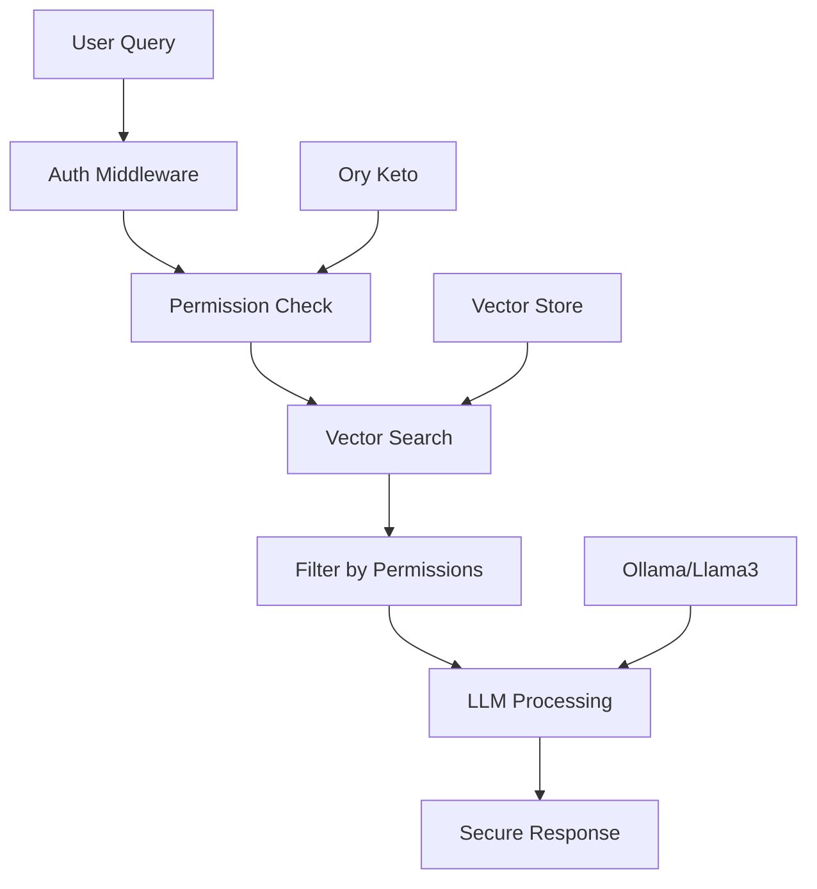

# LLM RAG with Relationship-Based Access Control (ReBAC)

A powerful demonstration of building secure, permission-aware AI systems that respect data boundaries while providing natural language interfaces to sensitive documents.

## What Makes This Cool?

This project solves a critical challenge in enterprise AI: **How do you build RAG systems that respect user permissions?**

Traditional RAG systems retrieve all matching documents regardless of who's asking. This demo shows how to:
- Build AI systems that automatically filter results based on user permissions
- Implement row-level security for document retrieval
- Use relationship-based access control for fine-grained permissions
- Maintain security without sacrificing the natural language experience

## Key Features

### Secure by Design
- **Permission-Aware RAG**: Queries automatically respect user access rights
- **Relationship-Based Access Control**: Using Ory Keto for enterprise-grade permissions
- **Multi-Tenant Architecture**: Different users see different results for the same query
- **Zero Trust**: Every query is permission-checked, no data leakage

### Technical Excellence
- **Local LLM**: Uses Llama3 via Ollama for complete data privacy
- **Vector Search**: Semantic search with embeddings for intelligent retrieval
- **Go Performance**: Fast, concurrent request handling
- **RESTful API**: Simple integration with any frontend

### Real-World Ready
- **Tax Document Demo**: Realistic scenario with sensitive financial data
- **Multiple User Roles**: Admin, limited access, and unauthorized users
- **Production Patterns**: Shows migration from simple to sophisticated permissions

## Architecture



## Quick Start

### Prerequisites

```bash
# Install all dependencies automatically
make install
```

This will:
- Check for Go installation (1.23+ required)
- Install Ollama and download required models (llama3, nomic-embed-text)
- Download Ory Keto binary
- Set up the database directory

### Running the Demo

#### Option 1: Using tmux (Recommended)

```bash
# Start both services in split terminal
make dev

# In another terminal, set up and test
make setup
make test
```

#### Option 2: Manual terminals

```bash
# Terminal 1: Start Keto
make start-keto

# Terminal 2: Start the application
make start-app

# Terminal 3: Setup and test
make setup
make test
```

### Available Commands

```bash
make help         # Show all available commands
make install      # Install all dependencies
make dev          # Start services (requires tmux)
make setup        # Configure permissions and load documents
make test         # Run all tests
make clean        # Clean up database and files
make reset        # Full reset and clean start
```

## How It Works

### 1. Document Upload
Documents are uploaded with metadata identifying the owner:
```json
{
  "title": "Tax Return 2023 - John Doe",
  "content": "...",
  "metadata": {
    "taxpayer": "John Doe",
    "year": 2023
  }
}
```

### 2. Permission Definition
Relationships are defined in Keto:
```json
{
  "namespace": "documents",
  "object": "john-doe:2023",
  "relation": "viewer",
  "subject_id": "alice"
}
```

### 3. Secure Querying
When Alice queries "What was the refund amount?":
1. System identifies Alice from the Bearer token
2. Retrieves relevant documents via vector search
3. Filters to only documents Alice can access
4. LLM processes only authorized documents
5. Returns answer based on permitted data

### 4. The Magic
- Bob asking the same question gets ABC Corporation's refund
- Alice gets John Doe's refund
- Peter (admin) could see all refunds
- Unauthorized users get an error

## API Endpoints

| Endpoint | Method | Auth | Description |
|----------|--------|------|-------------|
| `/health` | GET | No | Health check |
| `/documents` | POST | No | Upload documents |
| `/documents` | GET | Yes | List accessible documents |
| `/query` | POST | Yes | Query with natural language |
| `/permissions` | GET | Yes | Check user permissions |

## Example Usage

### Query Documents
```bash
curl -X POST http://localhost:8080/query \
  -H "Authorization: Bearer alice" \
  -H "Content-Type: application/json" \
  -d '{"question": "What was the total refund amount?"}'
```

### Check Permissions
```bash
curl http://localhost:8080/permissions \
  -H "Authorization: Bearer alice"
```

## Project Structure

```
.
├── main.go                      # Application entry point
├── internal/
│   ├── api/                     # REST API handlers
│   ├── auth/                    # Authentication middleware
│   ├── embeddings/              # Ollama embeddings client
│   ├── llm/                     # Ollama LLM client
│   ├── models/                  # Data structures
│   ├── permissions/             # Permission services
│   └── storage/                 # Vector store
├── keto/                        # Keto configuration
│   ├── config.yml               # Server configuration
│   └── definitions.opl          # Permission model
├── documents/                   # Sample data
│   ├── sample_documents.json    # Tax documents
│   └── relation_tuples.json     # Permissions
├── scripts/                     # Utility scripts
└── examples/                    # Test scenarios
    ├── 01-load-data/           # Document loading
    ├── 02-test-permissions/    # Permission tests
    └── 03-test-queries/        # Query tests
```

## Why This Architecture?

### Ory Keto for Permissions
- **Scalable**: Handles millions of permission checks
- **Flexible**: Supports complex hierarchies and relationships
- **Fast**: Optimized for read-heavy workloads
- **Standard**: Based on Google Zanzibar paper

### Local LLM with Ollama
- **Privacy**: No data leaves your infrastructure
- **Control**: Choose your model (Llama3, Mistral, etc.)
- **Cost**: No API fees or usage limits
- **Speed**: Low latency for local inference

### Go for the Backend
- **Performance**: Excellent concurrency for API servers
- **Simplicity**: Easy to understand and maintain
- **Deployment**: Single binary, no runtime dependencies
- **Type Safety**: Catch errors at compile time

## Security Considerations

- **Authentication**: Currently uses mock tokens (extend with real auth)
- **Transport**: Use HTTPS in production
- **Storage**: In-memory store (add persistent storage for production)
- **Secrets**: Never commit real credentials
- **Audit**: Log all permission checks and queries

## Extending the System

### Add New Document Types
1. Update the document model in `internal/models/`
2. Add embeddings for new fields
3. Define permission relationships

### Integrate Real Authentication
1. Replace mock auth in `internal/auth/`
2. Map JWT claims to Keto subjects
3. Add token validation

### Add Persistent Storage
1. Replace in-memory vector store
2. Options: Pinecone, Weaviate, Qdrant
3. Maintain permission filtering

### Scale Horizontally
1. Add Redis for session management
2. Use external vector database
3. Deploy Keto cluster
4. Load balance API servers

## Troubleshooting

### Common Issues

**Keto not running**
```bash
curl http://127.0.0.1:4467/health/ready
# Should return {"status":"ok"}
```

**Ollama models missing**
```bash
ollama list
# Should show llama3 and nomic-embed-text
```

**Permission denied errors**
```bash
# Check Keto has correct tuples
./.bin/keto relation-tuple get --namespace documents
```

## Contributing

Contributions are welcome! This is a proof-of-concept meant to inspire production implementations.

Areas for improvement:
- Add comprehensive tests
- Implement real authentication
- Add persistent storage
- Create a web UI
- Add more document types
- Implement audit logging

## License

MIT - Use this as a starting point for your secure RAG systems!

## Acknowledgments

- [Ory Keto](https://www.ory.sh/keto/) for the excellent permission system
- [Ollama](https://ollama.ai/) for making local LLMs accessible
- [Google Zanzibar](https://research.google/pubs/pub48190/) for the ReBAC concepts

---

Built with care to show how AI systems can be both powerful and secure.