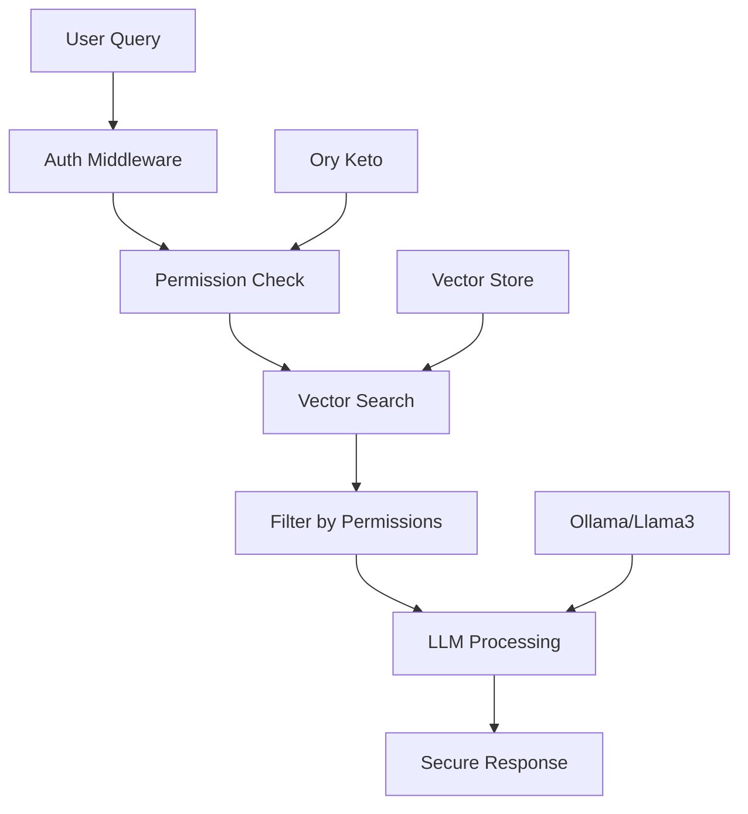

# ReRAG: Secure knowledge discovery with LLMs + RAG + ReBAC

This project demonstrates how to use large language models (LLMs) for
**knowledge discovery in documents while enforcing strict access controls**. The
core problem it addresses:

> How can you let users query a set of documents in natural language **without
> leaking information they don’t have permission to see**?

Typical RAG (retrieval-augmented generation) systems fetch all matching content.
That breaks down in multi-user or multi-tenant environments where different
people have different permissions. This repo shows how to solve that problem.

## Use case

Imagine a company storing tax returns, legal filings, or medical records.
Employees need to ask questions like:

- _“What was the refund amount for 2023?”_
- _“Which patients received treatment X?”_
- _“What contracts expire this quarter?”_

Without proper access controls, any employee could accidentally (or
intentionally) query documents they should never see. This demo ensures that:

- Only documents the user is authorized to view are even considered for
  retrieval.
- The LLM never sees unauthorized context, so it can’t hallucinate or leak
  sensitive data.
- Answers differ depending on who asks the question.

## Technologies

This demo uses **only open source tools**:

- [**Ory Keto**](https://www.ory.sh/keto/) — a relationship-based access control
  (ReBAC) system, based on Google Zanzibar, to model fine-grained permissions.
- [**Ollama**](https://ollama.ai/) — a local LLM runner that supports models
  like Llama 3 for inference and embedding.
- [**Llama** models — via Ollama**] — used for both embeddings (semantic search)
  and answering queries.

The backend is written in Go for simplicity, performance, and hackability.

## Why this repo exists

This repository is a **reference implementation**. It uses:

- In-memory vector stores
- Mock tokens for authentication
- Minimal setup with `make`

This keeps the demo simple to run and easy to extend. In production, you’d swap
in real authentication, persistent vector databases (Weaviate, Qdrant, Postgres,
…), and a Keto cluster.

We plan to advance this prototype depending on reception. Feedback from
developers and the broader community will guide the direction.

## Getting started

See [Quick Start](#quick-start) for installation and running instructions.
Everything runs locally, no external APIs required.

## Key Features

### Secure by Design

- **Permission-Aware RAG**: Queries automatically respect user access rights
- **Relationship-Based Access Control**: Using Ory Keto for enterprise-grade
  permissions
- **Multi-Tenant Architecture**: Different users see different results for the
  same query
- **Zero Trust**: Every query is permission-checked, no data leakage

### Technical Excellence

- **Local LLM**: Uses Llama3 via Ollama for complete data privacy
- **Vector Search**: Semantic search with embeddings for intelligent retrieval
- **Go Performance**: Fast, concurrent request handling
- **RESTful API**: Simple integration with any frontend

## Architecture



## Quick Start

### Prerequisites

You need [Go](https://go.dev), curl, [jq](https://jqlang.org), and [tmux](https://github.com/tmux/tmux) installed on a Unix-like system (Linux, macOS). Then:

```bash
# Install all dependencies automatically
make install
```

### Running the Demo

#### Option 1: Using tmux (Recommended)

```bash
# Start both services in split terminal
make dev

# In another terminal, set up and test
make setup
make test
```

#### Option 2: Manual terminals

```bash
# Terminal 1: Start Keto
make start-keto

# Terminal 2: Start the application
make start-app

# Terminal 3: Setup and test
make setup
make test
```

### Available Commands

```bash
make help         # Show all available commands
make install      # Install all dependencies
make dev          # Start services (requires tmux)
make setup        # Configure permissions and load documents
make test         # Run all tests
make clean        # Clean up database and files
make reset        # Full reset and clean start
```

## How It Works

### 1. Document Upload

Documents are uploaded with metadata identifying the owner:

```json
{
  "title": "Tax Return 2023 - John Doe",
  "content": "...",
  "metadata": {
    "taxpayer": "John Doe",
    "year": 2023
  }
}
```

### 2. Permission Definition

Relationships are defined in Keto:

```json
{
  "namespace": "documents",
  "object": "john-doe:2023",
  "relation": "viewer",
  "subject_id": "alice"
}
```

### 3. Secure Querying

When Alice queries "What was the refund amount?":

1. System identifies Alice from the Bearer token
2. Retrieves relevant documents via vector search
3. Filters to only documents Alice can access
4. LLM processes only authorized documents
5. Returns answer based on permitted data

### 4. The Magic

- Bob asking the same question gets ABC Corporation's refund
- Alice gets John Doe's refund
- Peter (admin) could see all refunds
- Unauthorized users get an error

## API Endpoints

| Endpoint       | Method | Auth | Description                 |
| -------------- | ------ | ---- | --------------------------- |
| `/health`      | GET    | No   | Health check                |
| `/documents`   | POST   | No   | Upload documents            |
| `/documents`   | GET    | Yes  | List accessible documents   |
| `/query`       | POST   | Yes  | Query with natural language |
| `/permissions` | GET    | Yes  | Check user permissions      |

## Example Usage

### Query Documents

```bash
curl -X POST http://localhost:8080/query \
  -H "Authorization: Bearer alice" \
  -H "Content-Type: application/json" \
  -d '{"question": "What was the total refund amount?"}'
```

### Check Permissions

```bash
curl http://localhost:8080/permissions \
  -H "Authorization: Bearer alice"
```

## Project Structure

```
.
├── main.go                      # Application entry point
├── internal/
│   ├── api/                     # REST API handlers
│   ├── auth/                    # Authentication middleware
│   ├── embeddings/              # Ollama embeddings client
│   ├── llm/                     # Ollama LLM client
│   ├── models/                  # Data structures
│   ├── permissions/             # Permission services
│   └── storage/                 # Vector store
├── keto/                        # Keto configuration
│   ├── config.yml               # Server configuration
│   └── definitions.opl          # Permission model
├── documents/                   # Sample data
│   ├── sample_documents.json    # Tax documents
│   └── relation_tuples.json     # Permissions
├── scripts/                     # Utility scripts
└── examples/                    # Test scenarios
    ├── 01-load-data/           # Document loading
    ├── 02-test-permissions/    # Permission tests
    └── 03-test-queries/        # Query tests
```

## Why This Architecture?

### Ory Keto for Permissions

- **Scalable**: Handles millions of permission checks
- **Flexible**: Supports complex hierarchies and relationships
- **Fast**: Optimized for read-heavy workloads
- **Standard**: Based on Google Zanzibar paper

### Local LLM with Ollama

- **Privacy**: No data leaves your infrastructure
- **Control**: Choose your model (Llama3, Mistral, etc.)
- **Cost**: No API fees or usage limits
- **Speed**: Low latency for local inference

### Go for the Backend

- **Performance**: Excellent concurrency for API servers
- **Simplicity**: Easy to understand and maintain
- **Deployment**: Single binary, no runtime dependencies
- **Type Safety**: Catch errors at compile time

## Security Considerations

- **Authentication**: Currently uses mock tokens (extend with real auth)
- **Transport**: Use HTTPS in production
- **Storage**: In-memory store (add persistent storage for production)
- **Secrets**: Never commit real credentials
- **Audit**: Log all permission checks and queries

## Extending the System

### Add New Document Types

1. Update the document model in `internal/models/`
2. Add embeddings for new fields
3. Define permission relationships

### Integrate Real Authentication

1. Replace mock auth in `internal/auth/`
2. Map JWT claims to Keto subjects
3. Add token validation

### Add Persistent Storage

1. Replace in-memory vector store
2. Options: Pinecone, Weaviate, Qdrant
3. Maintain permission filtering

### Scale Horizontally

1. Add Redis for session management
2. Use external vector database
3. Deploy Keto cluster
4. Load balance API servers

## Troubleshooting

### Common Issues

**Keto not running**

```bash
curl http://127.0.0.1:4467/health/ready
# Should return {"status":"ok"}
```

**Ollama models missing**

```bash
ollama list
# Should show llama3 and nomic-embed-text
```

**Permission denied errors**

```bash
# Check Keto has correct tuples
./.bin/keto relation-tuple get --namespace documents
```
