# ReRAG - ReBAC + RAG

RAG (Retrieval-Augmented Generation) lets LLMs answer questions about documents
by fetching relevant content and adding it to the prompt. It's everywhere:
customer support, enterprise search, legal discovery. But RAG doesn't work in
multi-user contexts where different users have different permissions. This
repository shows how to fix it with ReBAC (relationship based access control)
using [Ollama](https://ollama.com) and [Ory Keto](https://github.com/ory/keto),
an open source Google Zanzibar implementation.

**TL;DR**: Most RAG systems leak private data across users. This repo
demonstrates permission-aware RAG that guarantees the LLM never sees
unauthorized documents. Think Google Zanzibar meets embeddings — fork it, break
it, extend it.

## The Problem & Solution

### RAG only

```bash
# Alice queries the system
curl -X POST /query -H "Auth: bad-actor" \
  -d '{"question": "What was the total refund?"}'
# Response: "$1,200 for John Doe and $3,500 for ABC Corp"  ❌ DATA LEAK
```

### With ReRAG (ReBAC-powered RAG)

```bash
# Alice queries (can only see John Doe's docs)
curl -X POST /query -H "Auth: alice" \
  -d '{"question": "What was the total refund?"}'
# Response: "$1,200 for John Doe"  ✅

# Bob queries (can only see ABC Corp's docs)
curl -X POST /query -H "Auth: bob" \
  -d '{"question": "What was the total refund?"}'
# Response: "$3,500 for ABC Corporation"  ✅

# Bad actor queries (no docs at all)
curl -X POST /query -H "Auth: bad-actor" \
  -d '{"question": "What was the total refund?"}'
# Response: "You don't have access to any tax returns."  ✅
```

The model never sees text the user isn't authorized for. No prompt injection can
leak it.

## Quick demo

Please have [Ollama v0.12+](https://ollama.com) installed and running as well as
[Golang](https://go.dev) and ideally
[tmux](https://github.com/tmux/tmux/wiki/Installing).

First clone the repository:

```bash
git clone https://github.com/ory/rerag-rbac-rag-llm.git
cd rerag-rbac-rag-llm
```

Ensure you have an up-to-date Ollama version. This demo was tested with 0.12.x:

```bash
ollama -v
> ollama version is 0.12.1
```

Then run the demo:

```bash
# See it in action (requires Go with CGO, tmux, curl)
make install

# If you have tmux:
make dev

# If you do not have tmux:
make start-app
make start-keto

make demo
```

**Note**: This project requires CGO (C compiler) for sqlite-vec integration.
Ensure you have a C compiler installed:

- **macOS**: Install Xcode Command Line Tools (`xcode-select --install`)
- **Linux**: Install `build-essential` (`apt-get install build-essential`)
- **Windows**: Install MinGW-w64 or use WSL

This will:

1. Install dependencies
2. Start services
3. Load demo documents
4. Run permission-aware queries showing different results per user

See `config.example.yaml` for all configuration options.

## Why this matters

Standard RAG pulls all matching documents into context, then relies on the LLM
to "respect" permissions. That's a compliance nightmare waiting to happen. This
architecture:

- **Filters at retrieval**: Only authorized documents enter the vector search
  results
- **Never leaks**: Unauthorized content never reaches the LLM context window
- **No prompt injection**: Users can't trick the LLM into revealing data they
  shouldn't see
- **Audit-ready**: Every permission check is logged and traceable
- **Transport security**: Optional TLS/HTTPS encryption
- **Data at rest**: Optional SQLite database encryption

## Tech stack

All open source, runs locally:

- **[Ory Keto](https://www.ory.sh/keto/)**: Google Zanzibar-based ReBAC for
  permissions
- **[Ollama](https://ollama.ai/)**: Local LLM runner (`gemma3:1b` for inference,
  nomic for embeddings)
- **[SQLite](https://www.sqlite.org/)**: Persistent vector storage with optional
  encryption
- **[sqlite-vec](https://github.com/asg017/sqlite-vec)**: Fast vector similarity
  search directly in SQLite using KNN
- **Go**: For performance and hackability (requires CGO for sqlite-vec)
- **TLS/HTTPS**: Optional SSL encryption for secure transport

## How it works

```mermaid
graph TD

    %% ------------------------
    %% Add documents flow
    %% ------------------------
    subgraph ADD["📥 Document Management"]
      AA["New Document (POST /documents)"]
      AA --> H["Permission Assignment (Ory Keto)"]
      AA --> DD["Generate Embeddings (Ollama)"]
      DD --> I
    end

    %% ------------------------
    %% Query flow
    %% ------------------------
    subgraph QUERY["🔎 Query Documents"]
      A["📝 User Query"]
      A --> B["🔒 Auth Middleware"]
      B --> D["🔍 Vector KNN Search (sqlite-vec)"]
      D --> E["🛂 Permission Check (Ory Keto)"]
      E --> F["🤖 LLM Processing (Ollama)"]
      F --> G["✅ Secure Response"]
      I["SQLite vec0 Virtual Table"]
      J["Ollama / LLM"]
    end

    %% Wiring external systems
    H --> E
    I --> D
    J --> F
```



1. **Upload**: Documents tagged with owner metadata, embeddings stored in
   sqlite-vec
2. **Permissions**: Relationships defined in Keto (who can see what)
3. **Query**: User asks a question, embedding generated
4. **Vector Search**: sqlite-vec performs efficient KNN search in SQLite
5. **Filter**: Permission check ensures user can access retrieved documents
6. **Answer**: LLM processes authorized subset only

### Vector Search Performance

The system uses [sqlite-vec](https://github.com/asg017/sqlite-vec) for efficient
vector similarity search directly in SQLite:

- **Native SQL operations**: Vector search happens in the database, not in
  application memory
- **KNN algorithm**: K-nearest neighbors search using cosine distance
- **Efficient storage**: Vectors stored in a `vec0` virtual table with automatic
  indexing
- **No memory overhead**: Documents don't need to be loaded into memory for
  similarity computation
- **Scales with SQLite**: Leverages SQLite's proven performance and reliability
- **Adaptive recursive search**: Dynamically increases candidate pool when
  filtering reduces results
- **Permission-aware filtering**: Efficiently handles sparse permission
  scenarios without over-fetching

#### Recursive Search Algorithm

When searching with permission filters, the system uses an adaptive approach:

1. **Initial Search**: Fetches `topK × 2` candidates from sqlite-vec
2. **Filter Application**: Applies permission filter to candidates
3. **Adaptive Expansion**: If insufficient matches found:
   - Recursively doubles the candidate pool (growth factor: 2.0)
   - Continues until `topK` matches found or all documents searched
   - Safety limit of 10 attempts prevents infinite recursion
4. **Optimization**: Stops early when enough matches found or no more documents
   exist

This approach balances efficiency with completeness, adapting to different
permission distributions without requiring manual tuning.

## API examples

```bash
# Upload document
curl -X POST localhost:4477/documents \
  -d '{"title": "Tax Return", "content": "...", "metadata": {"taxpayer": "John Doe"}}'

# Query with permissions
curl -X POST localhost:4477/query \
  -H "Authorization: Bearer alice" \
  -d '{"question": "What was the refund amount?"}'

# Check what Alice can see
curl localhost:4477/permissions -H "Authorization: Bearer alice"
```

## Configuration

ReRAG supports flexible configuration via config files and environment
variables.

### Config File

Create a `config.yaml` file for persistent settings:

```yaml
# Example configuration file for LLM RAG ReBAC OSS
# Copy this to config.yaml and modify as needed

# Server configuration
server:
  host: 'localhost'
  port: 4477
  read_timeout: 30 # seconds
  write_timeout: 30 # seconds

  # TLS/HTTPS configuration
  tls:
    enabled: false # Set to true to enable HTTPS
    cert_file: '' # Path to TLS certificate file (required if enabled)
    key_file: '' # Path to TLS private key file (required if enabled)
    min_version: '1.3' # Minimum TLS version ("1.2" or "1.3")

# Database configuration
database:
  path: 'data/vector_store.db'

  # Database encryption using SQLCipher
  encryption:
    enabled: false # Set to true to enable database encryption
    key: '' # Encryption key (required if enabled)

# External services
services:
  # Ollama configuration
  ollama:
    base_url: 'http://localhost:11434'
    embedding_model: 'nomic-embed-text'
    llm_model: 'llama3.2:1b' # A model that fits on your machine / use case
    timeout: 60 # seconds

  # Ory Keto configuration
  keto:
    read_url: 'http://localhost:4466'
    write_url: 'http://localhost:4467'
    timeout: 10 # seconds

# Security settings
security:
  auth_mode: 'mock' # "mock" or "jwt"
  jwt_secret: '' # JWT secret (required if auth_mode is "jwt")
  error_mode: 'detailed' # "detailed" or "secure"

# Application settings
app:
  environment: 'development' # "development", "staging", or "production"
  log_level: 'info' # "debug", "info", "warn", or "error"
  log_format: 'text' # "text" or "json"
```

### Environment Variables

Override any setting with environment variables:

```bash
# Enable HTTPS
export SERVER_TLS_ENABLED=true
export SERVER_TLS_CERT_FILE=certs/cert.pem
export SERVER_TLS_KEY_FILE=certs/key.pem

# Enable database encryption
export DATABASE_ENCRYPTION_ENABLED=true
export DATABASE_ENCRYPTION_KEY=your-secret-key

# Production settings
export APP_ENVIRONMENT=production
export SECURITY_ERROR_MODE=secure
```

### SSL/TLS Setup

For HTTPS support, generate certificates:

```bash
# Development certificates (not for production!)
mkdir certs
openssl req -x509 -newkey rsa:4096 -keyout certs/key.pem \
  -out certs/cert.pem -days 365 -nodes \
  -subj "/CN=localhost"

# Enable in config
echo "server:" > config.yaml
echo "  tls:" >> config.yaml
echo "    enabled: true" >> config.yaml
echo "    cert_file: certs/cert.pem" >> config.yaml
echo "    key_file: certs/key.pem" >> config.yaml
```

### Database Encryption

Enable SQLite encryption for data at rest:

```yaml
database:
  encryption:
    enabled: true
    key: 'your-32-character-encryption-key'
```

⚠️ **Important**: Store encryption keys securely using environment variables or
key management systems in production.

## Architecture Details

### Vector Storage with sqlite-vec

The system uses a dual-table approach for efficient storage and retrieval:

1. **documents table**: Stores document metadata (id, title, content)
2. **vec_documents virtual table**: Stores vector embeddings using sqlite-vec's
   `vec0` module

This separation allows:

- Fast metadata queries without loading embeddings
- Efficient vector similarity search using native SQLite operations
- Dynamic embedding dimension support (auto-detected from first document)
- Adaptive search that scales with permission filtering requirements

#### Permission-Aware Vector Search

The vector search implementation combines sqlite-vec's KNN algorithm with an
adaptive recursive approach:

**SQL Query Pattern:**

```sql
-- Vector KNN search returning top K candidates
SELECT d.id, d.title, d.content, v.distance
FROM vec_documents v
JOIN documents d ON d.id = v.id
WHERE v.embedding MATCH ? AND k = ?
ORDER BY v.distance;
```

**Adaptive Filtering Algorithm:**

```
1. Start: Fetch topK × 2 candidates via KNN
2. Filter: Apply permission check to candidates
3. Evaluate:
   - If ≥ topK matches → Return results ✓
   - If all documents fetched → Return partial results ✓
   - Otherwise → Increase multiplier (×2) and recurse
4. Safety: Stop after 10 attempts, return best effort
```

**Example Scenario:**

```
User requests 5 documents
- Attempt 1: Fetch 10 candidates → 2 authorized → insufficient
- Attempt 2: Fetch 20 candidates → 4 authorized → insufficient
- Attempt 3: Fetch 40 candidates → 6 authorized → success (return 5)
```

This approach is particularly efficient when:

- Users have access to a significant subset of documents (minimal recursion)
- Permission distribution is sparse but consistent (predictable growth)
- Document corpus is large but user access is limited (avoids loading all
  vectors)

### Building and Development

The project requires CGO enabled for sqlite-vec:

```bash
# Build with CGO
CGO_ENABLED=1 go build -o bin/server .

# Run tests
CGO_ENABLED=1 go test ./...
```

The Makefile automatically sets `CGO_ENABLED=1` for all build operations.

## Future work

This is a working reference, not production code. Ideas for extensions:

- **Real Auth**: Replace mock tokens with OAuth2/OIDC ([Ory Hydra] works great
  with Ory Keto)
- **Scale Storage**: Swap SQLite for Pinecone/Weaviate/pgvector (keep sqlite-vec
  approach)
- **Audit Trail**: Add comprehensive logging for compliance
- **Reverse Expand**: Instead of using vector search to filter, use Keto to
  pre-filter document IDs
- **UI**: Build a simple web interface for uploading/querying documents
- **Vector Indexing**: Add HNSW or other ANN indexes for larger datasets

## CI/CD Performance

The GitHub Actions workflow includes optimizations for faster CI runs:

### Key Optimizations

- **🎯 Model Caching**: Ollama models are cached between CI runs using GitHub's
  cache action
- **⚡ Simple Setup**: Straightforward installation with minimal complexity
- **🔍 Quick Health Checks**: Simple service readiness verification

### Performance Gains

- **First run**: Downloads and caches models (~3-4 minutes)
- **Subsequent runs**: Uses cached models (~1-2 minutes)
- **Cache hit rate**: 90%+ for models that don't change

## Common issues

| Problem                   | Solution                                                      |
| ------------------------- | ------------------------------------------------------------- |
| Ollama connection refused | Run `ollama serve`                                            |
| Models missing            | Run `ollama pull llama3.2:1b && ollama pull nomic-embed-text` |
| Keto not running          | Check with `curl localhost:4467/health/ready`                 |
| TLS certificate errors    | Check cert file paths and permissions                         |
| Database encryption fails | Verify encryption key and SQLite encryption support           |
| Config validation errors  | Check required fields when features are enabled               |
| CGO build errors          | Ensure C compiler is installed (see requirements above)       |
| sqlite-vec not found      | Run `go mod tidy` and ensure CGO is enabled                   |

## Contributing

This is experimental code meant for learning and extending. PRs welcome!

## Feedback

Found this useful? Hit us with a star. Have ideas? Open an issue or PR.
