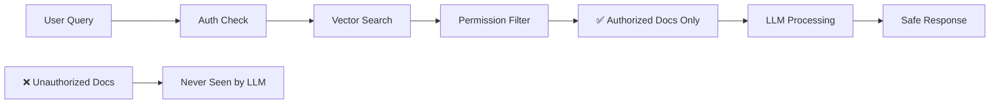

# ReRAG - ReBAC + RAG

RAG (Retrieval-Augmented Generation) lets LLMs answer questions about
documents by fetching relevant content and adding it to the prompt. It's
everywhere: customer support, enterprise search, legal discovery. But RAG
doesn't work in multi-user contexts where different users have different
permissions. This repository shows how to fix it with ReBAC (relationship based access control) using Ollama and Ory
Keto, an open source Google Zanzibar implementation.

**TL;DR**: Most RAG systems leak private data across users. This repo
demonstrates permission-aware RAG that guarantees the LLM never sees
unauthorized documents. Think Google Zanzibar meets embeddings — fork it, break
it, extend it.

## The Problem & Solution

### Before (Naive RAG)

```bash
# Alice queries the system
curl -X POST /query -H "Auth: bad-actor" \
  -d '{"question": "What was the total refund?"}'
# Response: "$8,500 for John Doe and $45,000 for ABC Corp"  ❌ DATA LEAK
```

### After (ReRAG - ReBAC-powered RAG)

```bash
# Alice queries (can only see John Doe's docs)
curl -X POST /query -H "Auth: alice" \
  -d '{"question": "What was the total refund?"}'
# Response: "$8,500 for John Doe"  ✅

# Bob queries (can only see ABC Corp's docs)
curl -X POST /query -H "Auth: bob" \
  -d '{"question": "What was the total refund?"}'
# Response: "$45,000 for ABC Corporation"  ✅

# Bad actor queries (no docs at all)
curl -X POST /query -H "Auth: bad-actor" \
  -d '{"question": "What was the total refund?"}'
# Response: "You don't have access to any tax returns."  ✅
```

The model never sees text the user isn't authorized for. No prompt
injection can leak it.

## Quick Demo

```bash
# See it in action (requires Go, tmux, curl)
make install
make dev
# Or if you do not have tmux:
# make start-app
# make start-keto

make demo
```

This will:

1. Install dependencies (Ollama, Keto)
2. Start services
3. Load sample tax documents
4. Run permission-aware queries showing different results per user

## Why This Matters

Standard RAG pulls all matching documents into context, then relies on the LLM
to "respect" permissions. That's a compliance nightmare waiting to happen. This
architecture:

- **Filters at retrieval**: Only authorized documents enter the vector search
  results
- **Never leaks**: Unauthorized content never reaches the LLM context window
- **Audit-ready**: Every permission check is logged and traceable

## Tech Stack

All open source, runs locally:

- **[Ory Keto](https://www.ory.sh/keto/)**: Google Zanzibar-based ReBAC for
  permissions
- **[Ollama](https://ollama.ai/)**: Local LLM runner (Llama3 for inference,
  nomic for embeddings)
- **[SQLite](https://www.sqlite.org/)**: Persistent vector storage
- **Go**: For performance and hackability

## How It Works



1. **Upload**: Documents tagged with owner metadata
2. **Permissions**: Relationships defined in Keto (who can see what)
3. **Query**: User asks a question
4. **Filter**: Only docs the user can access are retrieved
5. **Answer**: LLM processes authorized subset only

## API Examples

```bash
# Upload document
curl -X POST localhost:8080/documents \
  -d '{"title": "Tax Return", "content": "...", "metadata": {"taxpayer": "John Doe"}}'

# Query with permissions
curl -X POST localhost:8080/query \
  -H "Authorization: Bearer alice" \
  -d '{"question": "What was the refund amount?"}'

# Check what Alice can see
curl localhost:8080/permissions -H "Authorization: Bearer alice"
```

## Project Structure

```
internal/
├── api/          # REST handlers
├── permissions/  # Keto ReBAC integration
├── storage/      # SQLite vector store
└── llm/          # Ollama client

keto/            # Permission definitions
scripts/         # Setup utilities
examples/        # Test scenarios
```

## Extending This

This is a working reference, not production code. Ideas for extensions:

- **Real Auth**: Replace mock tokens with OAuth2/OIDC (Ory Hydra works great
  with Keto)
- **Scale Storage**: Swap SQLite for Pinecone/Weaviate/pgvector
- **Audit Trail**: Add comprehensive logging for compliance
- **Multi-tenancy**: Extend permission model for organizations

## Common Issues

| Problem                   | Solution                                                 |
| ------------------------- | -------------------------------------------------------- |
| Ollama connection refused | Run `ollama serve`                                       |
| Models missing            | Run `ollama pull llama3 && ollama pull nomic-embed-text` |
| Keto not running          | Check with `curl localhost:4467/health/ready`            |

## Contributing

This is experimental code meant for learning and extending. PRs welcome!

## Feedback

Found this useful? Hit us with a star. Have ideas? Open an issue or PR.
