# ReRAG - ReBAC + RAG

RAG (Retrieval-Augmented Generation) lets LLMs answer questions about documents
by fetching relevant content and adding it to the prompt. It's everywhere:
customer support, enterprise search, legal discovery. But RAG doesn't work in
multi-user contexts where different users have different permissions. This
repository shows how to fix it with ReBAC (relationship based access control)
using [Ollama](https://ollama.com) and [Ory Keto](https://github.com/ory/keto),
an open source Google Zanzibar implementation.

**TL;DR**: Most RAG systems leak private data across users. This repo
demonstrates permission-aware RAG that guarantees the LLM never sees
unauthorized documents. Think Google Zanzibar meets embeddings — fork it, break
it, extend it.

## The Problem & Solution

### RAG only

```bash
# Alice queries the system
curl -X POST /query -H "Auth: bad-actor" \
  -d '{"question": "What was the total refund?"}'
# Response: "$8,500 for John Doe and $45,000 for ABC Corp"  ❌ DATA LEAK
```

### With ReRAG (ReBAC-powered RAG)

```bash
# Alice queries (can only see John Doe's docs)
curl -X POST /query -H "Auth: alice" \
  -d '{"question": "What was the total refund?"}'
# Response: "$8,500 for John Doe"  ✅

# Bob queries (can only see ABC Corp's docs)
curl -X POST /query -H "Auth: bob" \
  -d '{"question": "What was the total refund?"}'
# Response: "$45,000 for ABC Corporation"  ✅

# Bad actor queries (no docs at all)
curl -X POST /query -H "Auth: bad-actor" \
  -d '{"question": "What was the total refund?"}'
# Response: "You don't have access to any tax returns."  ✅
```

The model never sees text the user isn't authorized for. No prompt injection can
leak it.

## Quick demo

Please have [Ollama](https://ollama.com) installed and running (`ollama serve`)
as well as [Golang](https://go.dev) and ideally
[tmux](https://github.com/tmux/tmux/wiki/Installing).

First clone the repository:

```bash
git clone https://github.com/ory/rerag-rbac-rag-llm.git
cd rerag-rbac-rag-llm
```

and ensure you have ollama running:

```bash
ollama serve
```

Then run the demo:

```bash
# See it in action (requires Go, tmux, curl)
make install

# If you have tmux:
make dev

# If you do not have tmux:
make start-app
make start-keto

make demo
```

This will:

1. Install dependencies
2. Start services
3. Load demo documents
4. Run permission-aware queries showing different results per user

See `config.example.yaml` for all configuration options.

## Why this matters

Standard RAG pulls all matching documents into context, then relies on the LLM
to "respect" permissions. That's a compliance nightmare waiting to happen. This
architecture:

- **Filters at retrieval**: Only authorized documents enter the vector search
  results
- **Never leaks**: Unauthorized content never reaches the LLM context window
- **No prompt injection**: Users can't trick the LLM into revealing data they
  shouldn't see
- **Audit-ready**: Every permission check is logged and traceable
- **Transport security**: Optional TLS/HTTPS encryption
- **Data at rest**: Optional SQLite database encryption

## Tech stack

All open source, runs locally:

- **[Ory Keto](https://www.ory.sh/keto/)**: Google Zanzibar-based ReBAC for
  permissions
- **[Ollama](https://ollama.ai/)**: Local LLM runner (Llama3 for inference,
  nomic for embeddings)
- **[SQLite](https://www.sqlite.org/)**: Persistent vector storage with optional
  encryption
- **Go**: For performance and hackability
- **TLS/HTTPS**: Optional SSL encryption for secure transport

## How it works

```mermaid
graph TD

    %% ------------------------
    %% Add documents flow
    %% ------------------------
    subgraph ADD["📥 Document Management"]
      AA["New Document (POST /documents)"]
      AA --> H["Permission Assignment (Ory Keto)"]
      AA --> DD["Generate Embeddings"]
      DD --> I
    end

    %% ------------------------
    %% Query flow
    %% ------------------------
    subgraph QUERY["🔎 Query Documents"]
      A["📝 User Query"]
      A --> B["🔒 Auth Middleware"]
      B --> D["🔍 Vector Search"]
      D --> E["🛂 Permission Check"]
      E --> F["🤖 LLM Processing"]
      F --> G["✅ Secure Response"]
      I["SQLite Vector Store (Embeddings)"]
      J["Ollama / Llama3 (LLM)"]
    end

    %% Wiring external systems
    H --> E
    I --> D
    J --> F
```



1. **Upload**: Documents tagged with owner metadata
2. **Permissions**: Relationships defined in Keto (who can see what)
3. **Query**: User asks a question
4. **Filter**: Only docs the user can access are retrieved
5. **Answer**: LLM processes authorized subset only

## API examples

```bash
# Upload document
curl -X POST localhost:8080/documents \
  -d '{"title": "Tax Return", "content": "...", "metadata": {"taxpayer": "John Doe"}}'

# Query with permissions
curl -X POST localhost:8080/query \
  -H "Authorization: Bearer alice" \
  -d '{"question": "What was the refund amount?"}'

# Check what Alice can see
curl localhost:8080/permissions -H "Authorization: Bearer alice"
```

## Configuration

ReRAG supports flexible configuration via config files and environment
variables.

### Config File

Create a `config.yaml` file for persistent settings:

```yaml
# Server configuration
server:
  host: 'localhost'
  port: 8080
  tls:
    enabled: false # Set to true for HTTPS
    cert_file: 'certs/cert.pem'
    key_file: 'certs/key.pem'
    min_version: '1.3' # TLS 1.2 or 1.3

# Database configuration
database:
  path: 'vector_store.db'
  encryption:
    enabled: false # Set to true for SQLite encryption
    key: '' # Your encryption key

# Security settings
security:
  error_mode: 'detailed' # "detailed" or "secure"

# Application settings
app:
  environment: 'development' # "development", "staging", "production"
  log_level: 'info' # "debug", "info", "warn", "error"
```

### Environment Variables

Override any setting with environment variables:

```bash
# Enable HTTPS
export SERVER_TLS_ENABLED=true
export SERVER_TLS_CERT_FILE=certs/cert.pem
export SERVER_TLS_KEY_FILE=certs/key.pem

# Enable database encryption
export DATABASE_ENCRYPTION_ENABLED=true
export DATABASE_ENCRYPTION_KEY=your-secret-key

# Production settings
export APP_ENVIRONMENT=production
export SECURITY_ERROR_MODE=secure
```

### SSL/TLS Setup

For HTTPS support, generate certificates:

```bash
# Development certificates (not for production!)
mkdir certs
openssl req -x509 -newkey rsa:4096 -keyout certs/key.pem \
  -out certs/cert.pem -days 365 -nodes \
  -subj "/CN=localhost"

# Enable in config
echo "server:" > config.yaml
echo "  tls:" >> config.yaml
echo "    enabled: true" >> config.yaml
echo "    cert_file: certs/cert.pem" >> config.yaml
echo "    key_file: certs/key.pem" >> config.yaml
```

### Database Encryption

Enable SQLite encryption for data at rest:

```yaml
database:
  encryption:
    enabled: true
    key: 'your-32-character-encryption-key'
```

⚠️ **Important**: Store encryption keys securely using environment variables or
key management systems in production.

## Future work

This is a working reference, not production code. Ideas for extensions:

- **Real Auth**: Replace mock tokens with OAuth2/OIDC ([Ory Hydra] works great
  with Ory Keto)
- **Scale Storage**: Swap SQLite for Pinecone/Weaviate/pgvector
- **Audit Trail**: Add comprehensive logging for compliance
- **Reverse Expand**: Instead of using vector search to filter, use Keto to
  pre-filter document IDs
- **UI**: Build a simple web interface for uploading/querying documents

## Common issues

| Problem                   | Solution                                                 |
| ------------------------- | -------------------------------------------------------- |
| Ollama connection refused | Run `ollama serve`                                       |
| Models missing            | Run `ollama pull llama3 && ollama pull nomic-embed-text` |
| Keto not running          | Check with `curl localhost:4467/health/ready`            |
| TLS certificate errors    | Check cert file paths and permissions                    |
| Database encryption fails | Verify encryption key and SQLite encryption support      |
| Config validation errors  | Check required fields when features are enabled          |

## Contributing

This is experimental code meant for learning and extending. PRs welcome!

## Feedback

Found this useful? Hit us with a star. Have ideas? Open an issue or PR.
